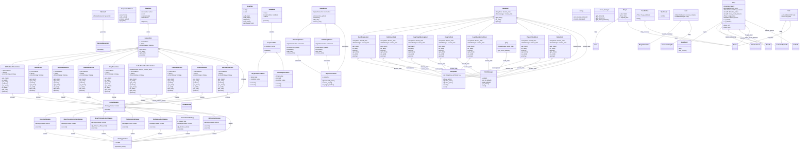

```mermaid
classDiagram
class MermaidGenerator {
+generate()
}
class Mermaid {
+MermaidGenerator: generator
}
class GoapAction {
+: preconditions
+: effects
+ActionStrategy: strategy
+get_clazz()
+is_valid()
+get_cost()
+perform()
}
class AddToWoodStockAction {
+: preconditions
+: effects
+ActionStrategy: strategy
+get_clazz()
+is_valid()
+get_cost()
+perform()
+get_clazz()
+is_valid()
+get_cost()
+perform()
}
GoapAction <|-- AddToWoodStockAction
class AvoidAction {
+: preconditions
+: effects
+ActionStrategy: strategy
+get_clazz()
+get_cost()
+perform()
+get_clazz()
+is_valid()
+get_cost()
+perform()
}
GoapAction <|-- AvoidAction
class BuildFirepitAction {
+: preconditions
+: effects
+ActionStrategy: strategy
+get_clazz()
+get_cost()
+perform()
+get_clazz()
+is_valid()
+get_cost()
+perform()
}
GoapAction <|-- BuildFirepitAction
class CalmDownAction {
+: preconditions
+: effects
+ActionStrategy: strategy
+get_clazz()
+get_cost()
+perform()
+get_clazz()
+is_valid()
+get_cost()
+perform()
}
GoapAction <|-- CalmDownAction
class ChopTreeAction {
+: preconditions
+: effects
+ActionStrategy: strategy
+get_clazz()
+is_valid()
+get_cost()
+perform()
+get_clazz()
+is_valid()
+get_cost()
+perform()
}
GoapAction <|-- ChopTreeAction
class CollectFromWoodStockAction {
+PackedScene: WOOD_STOCK_SPOT
+: preconditions
+: effects
+ActionStrategy: strategy
+get_clazz()
+is_valid()
+get_cost()
+perform()
+get_clazz()
+is_valid()
+get_cost()
+perform()
}
GoapAction <|-- CollectFromWoodStockAction
class FindCoverAction {
+: preconditions
+: effects
+ActionStrategy: strategy
+get_clazz()
+get_cost()
+perform()
+get_clazz()
+is_valid()
+get_cost()
+perform()
}
GoapAction <|-- FindCoverAction
class FindFoodAction {
+: preconditions
+: effects
+ActionStrategy: strategy
+get_clazz()
+get_cost()
+perform()
+get_clazz()
+is_valid()
+get_cost()
+perform()
}
GoapAction <|-- FindFoodAction
class GoToFirepitAction {
+: preconditions
+: effects
+ActionStrategy: strategy
+get_clazz()
+get_cost()
+perform()
+get_clazz()
+is_valid()
+get_cost()
+perform()
}
GoapAction <|-- GoToFirepitAction
class GoapActionPlanner {
+set_actions()
+add_action()
+remove_action()
+get_plan()
}
class DoActionStrategy {
+StrategyContext: context
+execute()
}
ActionStrategy <|-- DoActionStrategy
class MoveToLocationActionStrategy {
+StrategyContext: context
+execute()
}
ActionStrategy <|-- MoveToLocationActionStrategy
class MoveToTargetActionStrategy {
+StrategyContext: context
+@_distance_offset_setter()
+execute()
}
ActionStrategy <|-- MoveToTargetActionStrategy
class PickUpActionStrategy {
+StrategyContext: context
+execute()
}
ActionStrategy <|-- PickUpActionStrategy
class PutDownActionStrategy {
+StrategyContext: context
+execute()
}
ActionStrategy <|-- PutDownActionStrategy
class StrategyContext {
+: context
+@context_getter()
}
class TimerActionStrategy {
+: elapsed_time
+StrategyContext: context
+@_duration_setter()
+execute()
}
ActionStrategy <|-- TimerActionStrategy
class ActionStrategy {
+StrategyContext: context
+execute()
}
class GoapAgent {
+init()
+add_sensor()
}
class GoapCondition {
+: condition_name
+evaluate()
}
class IsTypeGoapCondition {
+: target_type
+: condition_name
+evaluate()
+evaluate()
}
GoapCondition <|-- IsTypeGoapCondition
class ValueGoapCondition {
+: target_value
+: operand
+: condition_name
+evaluate()
+evaluate()
}
GoapCondition <|-- ValueGoapCondition
class GoapGoal {
+GoapState: desired_state
+StateManager: context_state
+get_clazz()
+is_valid()
+priority()
}
class AvoidEnemyGoal {
+GoapState: desired_state
+StateManager: context_state
+get_clazz()
+is_valid()
+priority()
+get_clazz()
+is_valid()
+priority()
}
GoapGoal <|-- AvoidEnemyGoal
class CalmDownGoal {
+GoapState: desired_state
+StateManager: context_state
+get_clazz()
+is_valid()
+priority()
+get_clazz()
+is_valid()
+priority()
}
GoapGoal <|-- CalmDownGoal
class KeepFirepitBurningGoal {
+GoapState: desired_state
+StateManager: context_state
+get_clazz()
+is_valid()
+priority()
+get_clazz()
+is_valid()
+priority()
}
GoapGoal <|-- KeepFirepitBurningGoal
class KeepFedGoal {
+GoapState: desired_state
+StateManager: context_state
+get_clazz()
+is_valid()
+priority()
+get_clazz()
+is_valid()
+priority()
}
GoapGoal <|-- KeepFedGoal
class KeepWoodStockedGoal {
+GoapState: desired_state
+StateManager: context_state
+get_clazz()
+is_valid()
+priority()
+get_clazz()
+is_valid()
+priority()
}
GoapGoal <|-- KeepWoodStockedGoal
class PrepareWoodGoal {
+GoapState: desired_state
+StateManager: context_state
+get_clazz()
+is_valid()
+priority()
+get_clazz()
+is_valid()
+priority()
}
GoapGoal <|-- PrepareWoodGoal
class RelaxGoal {
+GoapState: desired_state
+StateManager: context_state
+get_clazz()
+is_valid()
+priority()
+get_clazz()
+is_valid()
+priority()
}
GoapGoal <|-- RelaxGoal
class goap {
+StateManager: world_state
+get_action_planner()
}
class MultiActionStrategy {
+StrategyContext: context
+execute()
+execute()
}
ActionStrategy <|-- MultiActionStrategy
class GoapPlan {
+: steps
+: cost
+add_step()
+add_steps()
+duplicate()
+has_action()
+recalculate_cost()
}
class GoapRule {
+: name
+GoapCondition: condition
+: effects
+process()
}
class GoapSensor {
+SignalConnection: connection
+@connection_getter()
+reconnect()
+add_rule()
+remove_rule()
}
class NodeGoapSensor {
+SignalConnection: connection
+@connection_getter()
+reconnect()
+add_rule()
+remove_rule()
}
GoapSensor <|-- NodeGoapSensor
class ValueGoapSensor {
+SignalConnection: connection
+@connection_getter()
+reconnect()
+add_rule()
+remove_rule()
}
GoapSensor <|-- ValueGoapSensor
class SignalConnection {
+: connected
+@connected_getter()
+connect_signal()
+set_signal_emitter()
}
class GoapState {
+res://goap/goap.gd.States: key
+@key_getter()
+@value_setter()
+@value_getter()
+equals()
+copy()
}
class StateManager {
+update()
+get_or_default()
+apply_effects()
+get_states()
+clear()
}
class GoapStep {
+GoapAction: action
+: cost
+: desired_state
+: blackboard
+duplicate()
}
class debug {
+set_console_container()
+console_message()
}
class scene_manager {
+get_element()
+get_elements()
+get_closest_element()
}
class Firepit {
+Label: label
+Timer: timer
+: elapsed_time
}
class main {
+MarginContainer: console_container
+CharacterBody2D: satyr
}
class Mushroom {
+: nutrition
}
class satyr {
+GoapAgent: agent
+AnimatedSprite2D: body
+VBoxContainer: labels_container
+Area2D: detection_radius
+Area2D: close_proxity_detector
+Timer: hunger_timer
+Node2D: rotation_anchor
+: is_moving
+: is_attacking
+move_to()
+chop_tree()
}
class TreeToChop {
+Timer: chop_cooldown
+chop()
}
class Troll {
+AnimatedSprite2D: body
+Timer: rest_timer
}
Mermaid o-- MermaidGenerator : generator
GoapAction o-- ActionStrategy : strategy
AddToWoodStockAction o-- ActionStrategy : strategy
AvoidAction o-- ActionStrategy : strategy
BuildFirepitAction o-- ActionStrategy : strategy
CalmDownAction o-- ActionStrategy : strategy
ChopTreeAction o-- ActionStrategy : strategy
CollectFromWoodStockAction o-- PackedScene : WOOD_STOCK_SPOT
CollectFromWoodStockAction o-- ActionStrategy : strategy
FindCoverAction o-- ActionStrategy : strategy
FindFoodAction o-- ActionStrategy : strategy
GoToFirepitAction o-- ActionStrategy : strategy
DoActionStrategy o-- StrategyContext : context
MoveToLocationActionStrategy o-- StrategyContext : context
MoveToTargetActionStrategy o-- StrategyContext : context
PickUpActionStrategy o-- StrategyContext : context
PutDownActionStrategy o-- StrategyContext : context
TimerActionStrategy o-- StrategyContext : context
ActionStrategy o-- StrategyContext : context
GoapGoal o-- GoapState : desired_state
GoapGoal o-- StateManager : context_state
AvoidEnemyGoal o-- GoapState : desired_state
AvoidEnemyGoal o-- StateManager : context_state
CalmDownGoal o-- GoapState : desired_state
CalmDownGoal o-- StateManager : context_state
KeepFirepitBurningGoal o-- GoapState : desired_state
KeepFirepitBurningGoal o-- StateManager : context_state
KeepFedGoal o-- GoapState : desired_state
KeepFedGoal o-- StateManager : context_state
KeepWoodStockedGoal o-- GoapState : desired_state
KeepWoodStockedGoal o-- StateManager : context_state
PrepareWoodGoal o-- GoapState : desired_state
PrepareWoodGoal o-- StateManager : context_state
RelaxGoal o-- GoapState : desired_state
RelaxGoal o-- StateManager : context_state
goap o-- StateManager : world_state
MultiActionStrategy o-- StrategyContext : context
GoapRule o-- GoapCondition : condition
GoapSensor o-- SignalConnection : connection
NodeGoapSensor o-- SignalConnection : connection
ValueGoapSensor o-- SignalConnection : connection
GoapStep o-- GoapAction : action
Firepit o-- Label : label
Firepit o-- Timer : timer
main o-- MarginContainer : console_container
main o-- CharacterBody2D : satyr
satyr o-- GoapAgent : agent
satyr o-- AnimatedSprite2D : body
satyr o-- VBoxContainer : labels_container
satyr o-- Area2D : detection_radius
satyr o-- Area2D : close_proxity_detector
satyr o-- Timer : hunger_timer
satyr o-- Node2D : rotation_anchor
TreeToChop o-- Timer : chop_cooldown
Troll o-- AnimatedSprite2D : body
Troll o-- Timer : rest_timer
```
